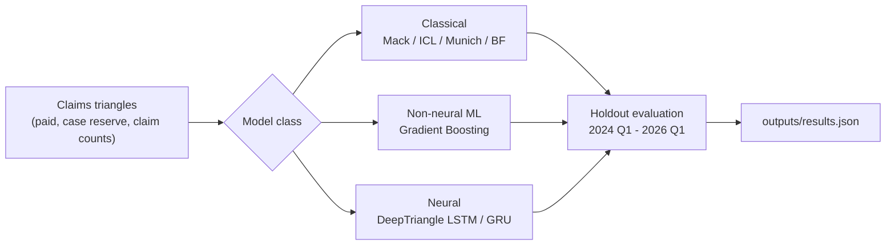

# Motor Loss Reserving: Classical and Deep Learning Baselines

[](https://github.com/Azeem-Ashmal/motor-loss-reserving-dl/actions/workflows/ci.yml)

Quarterly loss reserving on Malaysian comprehensive private car claims (Theft
and Windscreen perils). Classical actuarial methods (Mack Paid Chain Ladder,
Incurred Chain Ladder, Munich Chain Ladder, Bornhuetter-Ferguson) are
benchmarked against a non-neural machine learning control (Gradient Boosting)
and a neural model (a DeepTriangle-inspired LSTM). This is the reserving
pipeline behind an MSc dissertation.



## Data availability

**No claims data is included in this repository.** The dissertation's results
were produced on a proprietary industry motor-claims database that cannot be
redistributed in any form or aggregation. `data/synthetic/` provides a
generator that produces a structurally identical, obviously-fake triangle set
so the full pipeline can be run and inspected by anyone. See `data/README.md`
for the exact schema.

**Process note.** If you populate a local directory with real triangles to
reproduce the dissertation's results (as `.local_verification_data/` was used
during development), it is `.gitignore`d and never reaches GitHub, but it is
not otherwise protected: do not zip, email, or otherwise hand off the working
folder as a whole without first checking that directory is excluded. The
governance commitment in the dissertation's Section 1.1 (no individual claim
record or proprietary data leaves this project) extends to how the folder
itself is shared, not just to what gets committed.

## Installation

```Shell
git clone https://github.com/Azeem-Ashmal/motor-loss-reserving-dl.git
cd motor-loss-reserving-dl
python3 -m venv .venv && source .venv/bin/activate
pip install -r requirements.txt
```

Python version and exact package versions used to produce the dissertation's
results are pinned in `requirements-lock.txt` and echoed in `env_block.tex`.

## Quickstart

Runs end to end on the bundled synthetic data (~2-5 minutes on CPU):

```Shell
python scripts/run_all.py
```

Writes `outputs/results.json` (every reserving/metric number the pipeline
computes) and, once implemented for a given figure, `outputs/figures/`.

## Reproducing the dissertation results

You need your own copy of equivalent quarterly claims triangles, laid out per
`data/README.md`. An optional `exposure_qtr.csv` per peril (same directory)
enables the Bornhuetter-Ferguson baseline; without it, BF is skipped and every
other model still runs.

```Shell
python scripts/run_all.py --data-dir /path/to/real/data --seed 42
python scripts/run_multiseed.py --peril theft --data-dir /path/to/real/data
python scripts/run_pooled_multiseed.py --data-dir /path/to/real/data
```

- `run_all.py` produces the single-seed, single-peril reserving table for
  both perils.
- `run_multiseed.py` produces the single-peril seed-variance distribution.
  The 20 seeds are listed explicitly in `config/seeds.yaml` rather than
  generated at runtime, so the same seeds run every time.
- `run_pooled_multiseed.py` runs the pooled multi-peril architecture (below)
  across the same 20 seeds.

### Pooled multi-peril architecture and interpretability

`src/pipeline.py`'s `run_pooled_lstm_evaluation` trains one LSTM on both
perils at once, with a learned embedding telling it which peril each cohort
belongs to, instead of training two separate single-peril models. The idea
was to help the more data-scarce peril by giving the network twice the
training data to learn shared structure from. Tested across a full 20-seed
sweep (`scripts/run_pooled_multiseed.py`), the result is mixed: it does not
reliably improve the data-scarce peril, and reliably worsens the data-rich
one. See "Verified findings" below for the numbers.

`src/interpretability.py`'s `occlusion_analysis` answers "what is the model
actually using" by ablating one input channel at a time (replacing its
entire observed history with a neutral value) and measuring the change in
holdout accuracy. It's a simpler substitute for SHAP, whose standard
implementations don't support variable-length recurrent models well. A
channel whose removal *improves* accuracy was hurting the forecast; a
channel whose removal *worsens* accuracy was helping it.

`scripts/run_pooled_ensemble.py` averages the 20 checkpoints from a completed
`run_pooled_multiseed.py` sweep and rolls the average forward, to test
whether simple ensembling could fix the architecture's seed-to-seed
instability for free.

## Verified findings

The table below summarises the headline reserving results (holdout error as
a % of the actual reserve; negative means the model under-projected). Full
statistical detail — derivations, t-tests, and discussion — lives in the
dissertation this repository accompanies.

**Theft** (medium-tail, low-frequency, high-severity)

| Model                                  | Mean error | vs. ICL | vs. LSTM baseline |
| --------------------------------------- | ---------: | --------------------- | --------------------- |
| Incurred Chain Ladder (ICL)             |     +1.3%  | benchmark              | -- |
| Mack Paid Chain Ladder                  |    +56.0%  | worse                  | -- |
| DeepTriangle LSTM, single-peril (20-seed) | +34.2% ± 35.4pp | worse (t=4.16, p=0.0005) | baseline |
| DeepTriangle LSTM, pooled perils (20-seed) | +47.2% ± 35.9pp | worse (t=5.72, p=0.00002) | not significantly different (t=1.16, p=0.25) |
| DeepTriangle GRU, single-peril (20-seed) | +39.9% ± 43.4pp | worse (t=3.97, p=0.0008) | not significantly different (t=0.50, p=0.62) |
| DeepTriangle LSTM + claim counts (20-seed) | +65.6% ± 47.6pp | worse (t=6.04, p=0.000008) | worse (t=2.40, p=0.027) |

**Windscreen** (short-tail, high-frequency, low-severity)

| Model                                    | Mean error | vs. ICL |
| ----------------------------------------- | ---------: | ------- |
| Incurred Chain Ladder (ICL)               |     -2.8%  | benchmark |
| Mack Paid Chain Ladder                    |     -3.2%  | worse   |
| DeepTriangle LSTM, single-peril (20-seed) | -75.5% ± 8.4pp | worse   |
| DeepTriangle LSTM, pooled perils (20-seed) | -80.2% ± 5.2pp | worse   |

**What this means:** on Theft, no neural variant tested (single-peril,
pooled, GRU cell, or an added claim-count feature) matches the classical
Incurred Chain Ladder, and every one of the 20 seeds run for each variant
individually underperforms it. An occlusion analysis points to the reason:
with only 1,128 training cells, the model over-extrapolates rather than
ignoring its inputs — a training-data ceiling, not a fixable architecture
choice. Averaging the pooled architecture's 20 checkpoints into an ensemble
confirms this: the ensemble's error equals the mean of its 20 seeds to four
decimal places on Theft and five on Windscreen, the signature of a shared,
systematic bias that ensembling cannot cancel. On Windscreen every model
under-projects, and pooling makes it worse rather than better.

Separately, `MackPaidChainLadder.mack_windowed_bootstrap` derives a
stochastic uncertainty interval for the exact calendar window these reserve
figures use (rather than the standard full-run-off quantity most Mack
implementations report). On real data (8,000 simulations): Theft's windowed
reserve has a mean of RM 79,933k and a coefficient of variation of 33.2%
(90% interval RM 37,139k-124,551k); Windscreen's mean is RM 74,997k with a
tighter CV of 14.7% (90% interval RM 56,435k-93,265k). Both reconcile to
within 1% of the deterministic chain-ladder point estimate for the same
window, as the method's own unbiasedness predicts.

The same simulation methodology applies just as well to the incurred
triangle: `IncurredChainLadder.icl_windowed_bootstrap` measures ICL's own
windowed uncertainty directly, rather than treating its point estimate as
exact by assumption. On real data: Theft's windowed ICL reserve has a CV of
8.55% (90% interval RM 44,818k-59,417k); Windscreen's is 2.09% (90% interval
RM 72,613k-77,844k) — both markedly tighter than Mack's. For context: Theft's
LSTM mean error (+34.2%) falls inside Mack's own uncertainty envelope for
that peril, but the single-peril LSTM's mean projected reserve falls
*outside* ICL's measured 90% interval on both perils — the LSTM is failing
to beat a benchmark now confirmed precise, not merely assumed to be.

**Paid-only controls** (`run_paid_only_baselines.py`) complete the information-set
grid: a paid-only GBM is far worse than the joint-feature GBM on Theft
(+85.4% vs. +15.9%) but roughly level on Windscreen; a paid-only LSTM is
dramatically better on Theft on a single seed (-0.8% vs. +50.9%) but worse on
Windscreen. The LSTM result is single-seed only and needs the same 20-seed
treatment as everything else here before it can be trusted.

**Duan (1983) smearing correction** (`run_smearing_correction.py`) was
implemented and applied, not left undone: the smearing factor is 184.9
(Theft) and 12.7 (Windscreen), both driven by a heavy right tail in the
training residuals rather than a well-behaved correction, and retransforming
with them makes the reported error far worse (+27,802% and +327%) than the
uncorrected figures. The underlying retransformation bias is real; the
standard fix for it is numerically unusable at this data volume.

### Bugs found and fixed during verification

| Bug | Impact | Fix |
| --- | --- | --- |
| PyTorch weight initialisation was never seeded | "Seed 42" results weren't actually reproducible | Full determinism control added (`src/seeding.py`) |
| Hand-rolled Mack standard-error formula under-counted by ~1.85x | Wrong uncertainty intervals | Cross-checked against `chainladder` on the published RAA benchmark triangle and corrected |
| Windowed Mack bootstrap included cohorts that only begin inside the holdout window | Inflated the simulated reserve roughly eightfold | Restricted to cohorts that already existed as of the calibration cutoff |
| Windowed Mack bootstrap drew the link-ratio parameter independently per cohort | Understated cross-cohort correlation Mack's own formula accounts for | Draw one shared parameter per simulated development period, applied to every cohort |
| Active-cell materiality filter was hardcoded to RM 1, not the documented RM 1,000 | RMSE/MAE understated (barely filtered any cells); reserve totals and error % were unaffected | Shared `ACTIVE_CELL_THRESHOLD_RM` constant; re-run confirmed n_active 123→90 (Theft), 147→122 (Windscreen) |
| `requirements-lock.txt` was a raw `pip freeze` of the host machine | Listed ~75 unrelated OS packages (`aptdaemon`, `bcc`, `systemd-python`, etc.) alongside real dependencies | Regenerated from the actual transitive dependency closure via `importlib.metadata`; 34 genuine packages remain |

## Repository layout

```
├── .github/workflows/ci.yml  # runs tests + run_all.py on synthetic data on every push
├── config/
│   ├── default.yaml          # split cutoffs, hyperparameters - not derived from real data
│   └── seeds.yaml            # explicit 20-seed list for the multi-seed run
├── data/
│   ├── README.md              # expected schema; no real data
│   └── synthetic/             # generator + generated synthetic triangles
├── src/
│   ├── data_pipeline.py       # loading, scaling, tensorising, zero-leakage split
│   ├── seeding.py             # single source of truth for determinism
│   ├── train.py                # LSTM training loop, early stopping
│   ├── evaluate.py             # autoregressive rollout, metrics
│   ├── pipeline.py             # single-peril AND pooled multi-peril evaluation
│   ├── interpretability.py     # occlusion-based channel importance
│   ├── diagnostics.py          # pre/post-period link ratio comparison
│   ├── metrics.py              # per-unit Freq x Sev = BC identities
│   ├── classical/              # mack.py, icl.py (+ windowed ICL bootstrap), munich.py, bf.py
│   └── ml/                     # lstm.py, gbm.py
├── scripts/
│   ├── run_all.py              # single-seed full pipeline, both perils
│   ├── run_multiseed.py        # 20-seed single-peril LSTM variance experiment;
│   │                           # --rnn-type lstm|gru, --use-counts for the two
│   │                           # architecture/feature variants tested this round
│   ├── run_pooled_multiseed.py # 20-seed pooled multi-peril LSTM variance experiment
│   ├── run_pooled_ensemble.py  # averages the pooled sweep's 20 checkpoints' predictions
│   ├── run_pooled_single_seed.py  # seed-42 pooled evaluation (Table 5.6's pooled row)
│   ├── run_occlusion.py        # occlusion analysis, single-peril and pooled
│   ├── run_paid_only_baselines.py # paid-only GBM and paid-only LSTM (RQ1's third grid cell)
│   ├── run_smearing_correction.py # applies Duan (1983) smearing to the seed-42 LSTM
│   ├── make_figures.py         # generic CI smoke-check figures from outputs/results.json
│   ├── make_env_block.py       # env_block.tex from requirements-lock.txt
│   ├── make_pooled_comparison_figure.py  # single-peril vs. pooled 20-seed boxplots
│   ├── make_*_figure.py        # the dissertation's other embedded figures: cumulative
│   │                           # run-off, holdout scatter, the 65-quarter inflation series -
│   │                           # each built directly from the real triangles or
│   │                           # outputs/results.json, documented in its own docstring
│   └── extra/                  # figure scripts not currently embedded in the dissertation
│                               # (exposure series, link-ratio period, settlement curve,
│                               # severity index, triangle heatmap) - kept for reference,
│                               # not wired into any current chapter
├── outputs/                    # gitignored; regenerate, don't commit
└── tests/
    ├── test_classical_models.py     # unit tests against a hand-worked example
    ├── test_metrics.py               # per-unit identity tests
    ├── test_interpretability.py      # occlusion harness sanity check
    ├── test_pooled_pipeline.py       # pooled architecture smoke + determinism
    ├── test_mack_windowed_bootstrap.py  # windowed Mack SE determinism + reconciliation
    ├── test_icl_windowed_bootstrap.py   # windowed ICL SE determinism + reconciliation
    ├── test_architecture_variants.py    # GRU cell and claim-count-feature smoke + determinism
    ├── test_duan_smearing.py        # smearing retransformation + psi-estimation unit tests
    └── test_reconciliation.py        # integration tests against outputs/results.json
```

## Method summary

| Model                  | Information set                | Class                        |
| ---------------------- | ------------------------------ | ---------------------------- |
| Mack Paid Chain Ladder | Paid only                      | Classical, deterministic     |
| Bornhuetter-Ferguson   | Paid + exposure prior          | Classical, exposure-anchored |
| Incurred Chain Ladder  | Incurred (paid + case reserve) | Classical, deterministic     |
| Munich Chain Ladder    | Joint paid + case reserve      | Classical, joint             |
| Gradient Boosting      | Joint paid + case reserve      | Non-neural ML                |
| DeepTriangle LSTM      | Joint paid + case reserve      | Neural, autoregressive       |

Indexing convention throughout: `i` = accident quarter (0-indexed), `j` =
development quarter (0-indexed), `k = i + j` = calendar quarter. A cell is
observed only while `k` does not exceed the last available calendar quarter.

## Tests

```Shell
python scripts/run_all.py                 # writes outputs/results.json
python -m unittest discover -s tests -v
```

Only the standard library's `unittest` is required, no extra test-runner
dependency to install. Nine files, 30 tests, two kinds of check:

- `test_classical_models.py`, `test_metrics.py`, `test_interpretability.py`,
  `test_pooled_pipeline.py`, `test_mack_windowed_bootstrap.py`,
  `test_icl_windowed_bootstrap.py`, and
  `test_architecture_variants.py` are unit tests against hand-computable
  examples or internal-consistency checks (including a small hand-computable
  4x4 chain-ladder example, not drawn from the dissertation), independent of
  any real claims data file — they run
  against the bundled synthetic data instead.
- `test_reconciliation.py` is an integration suite: it checks internal
  identities against whatever is currently in `outputs/results.json`, rather
  than against a hardcoded target answer, so it fails honestly if a future
  code change breaks a number's derivation. It's what caught two of the real
  bugs listed above during this pipeline's own development.

## Continuous integration

`.github/workflows/ci.yml` runs the full test suite plus `run_all.py` and
`make_figures.py` on every push and pull request, entirely against the
bundled synthetic data. It never receives a `--data-dir` argument, so it has
no access to and makes no use of anyone's real data, on this repository or a
fork of it. Its only purpose is to prove, automatically and on a clean
checkout, that the pipeline installs and runs end to end exactly as this
README describes. Pointing the pipeline at your own real data (see
"Reproducing the dissertation results" above) is a separate, manual, local
step — CI does not do this for you.

## Licence

This project is licensed under the [PolyForm Noncommercial License 1.0.0](https://polyformproject.org/licenses/noncommercial/1.0.0).
In short: you may view, run, modify, and share this code freely for any
noncommercial purpose (personal study, research, education, hobby projects).
Commercial use requires the copyright holder's separate permission. See the
`LICENSE` file for the full, binding terms.

This repository contains no real claims data of any kind.
